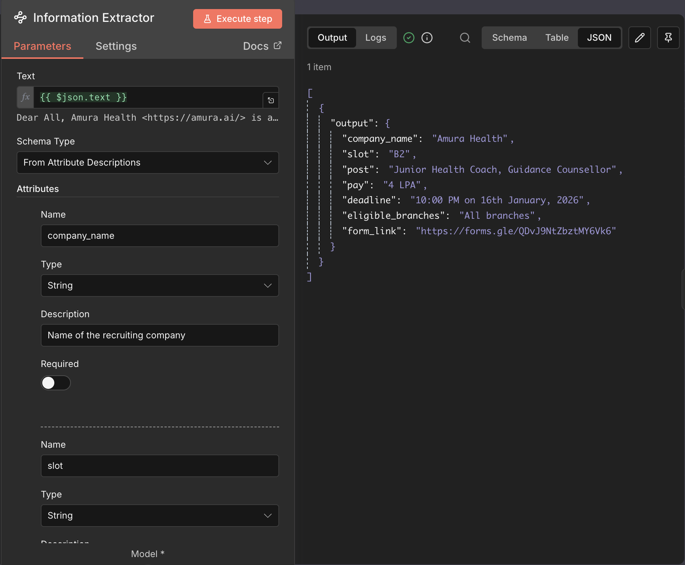

# Placementbot

Automated **agentic workflow** built with **n8n**, **Telegram Bot**, and **LLM integration** to extract structured placement deadlines from emails and send real-time automated reminders. :contentReference[oaicite:1]{index=1}

---

## Overview

Placementbot keeps track of incoming placement notification and reminds you beofre deadline without any human intervention. It:

- Parses structured info from incoming placement emails.
- Detects deadlines and key metadata.  
- Sends Telegram alerts as reminders.   
- Runs as an n8n workflow for repeatable automation.

---

## 🧠 Workflow Architecture

> The core automation is defined in an n8n workflow JSON (`workflow.json`).  
> It listens for incoming triggers, extracts data using LLM logic, and sends Telegram notifications.

### 🖼️ Workflow Preview

  
*Import view of the n8n workflow showing node layout.*

  
*Nodes that handle parsing and structured extraction.*

---

## 💬 Sample Reminder Message

This shows sample of how the bot sends mail alert and reminder one hour before deadline.

  
*Example of a raw placement email that the workflow ingests.*

---

## 🛠️ Built With

| Technology | Purpose |
|------------|---------|
| **n8n** | Workflow automation engine |
| **Telegram Bot API** | Sending notifications |
| **Gemini / LLM Node** | Structured data extraction |
| **Webhook Triggers** | Listens for incoming emails |
